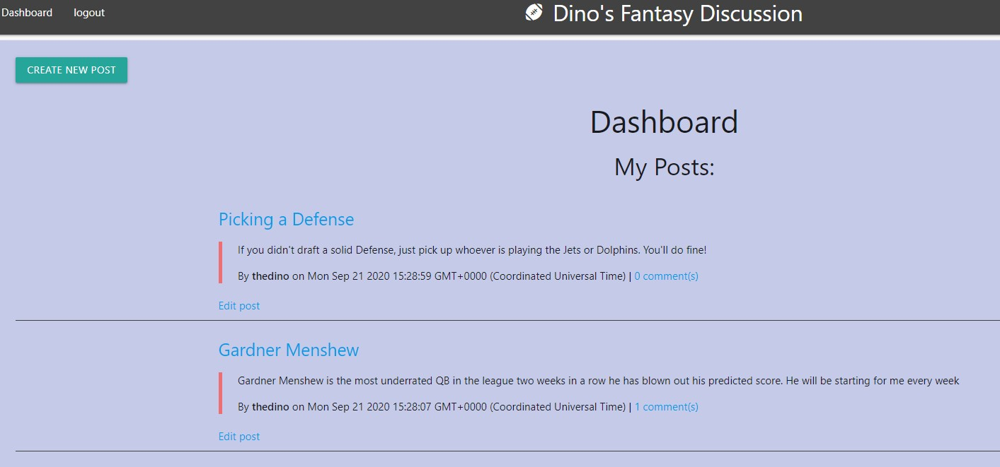
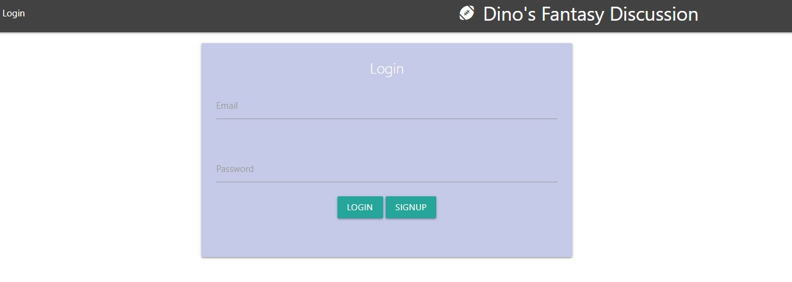
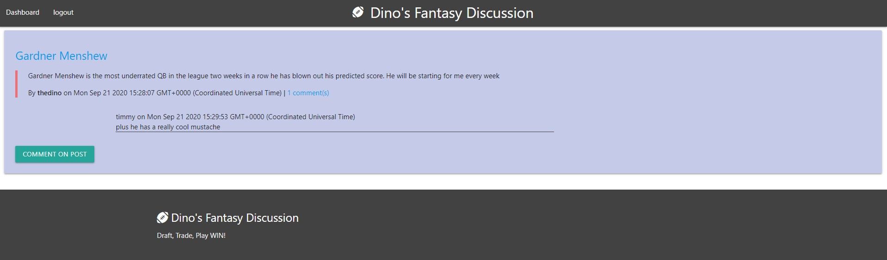

# Fantasy Football Blog

## Purpose 

To provide users with a blog site where they can discuss fantasy football.  Users are able to make posts as well as comment on others posts.  It is a great place for banter, tips and fun during football season.

## Features 

When a user is not logged into their profile they can view the homepage with all of the posts ordered in descending order by latest post.  If they try to view a single post they will be prompted to login or signup.  Once logged in they can view the comments on a single post and also write their own comment.  On the dashboard they can make a new post.  They could also edit or delete a post they have already made

## Built with

 * Javascript
 * Node JS 
 * Express JS
 * MYSQL2
 * Sequelize
 * Dotenv
 * BCrypt
 * Materialize
 * Handlebars

 ## API testing 
 POSTMAN

 ## Usage
 To run locally: npm start 

 ## Deployed Site 

 https://dinosfootball.herokuapp.com/

 ## Contribution
 Created by Neil Dino